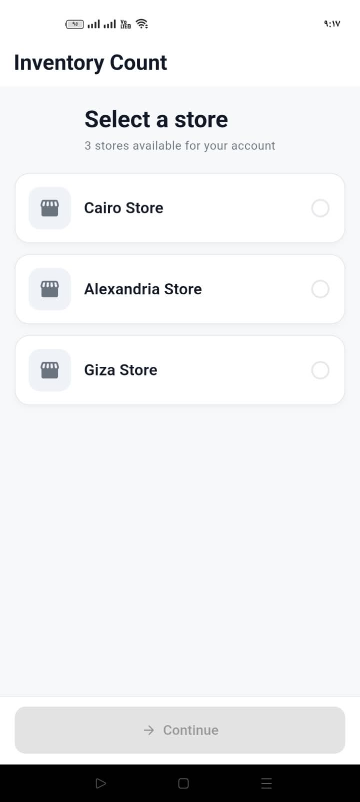
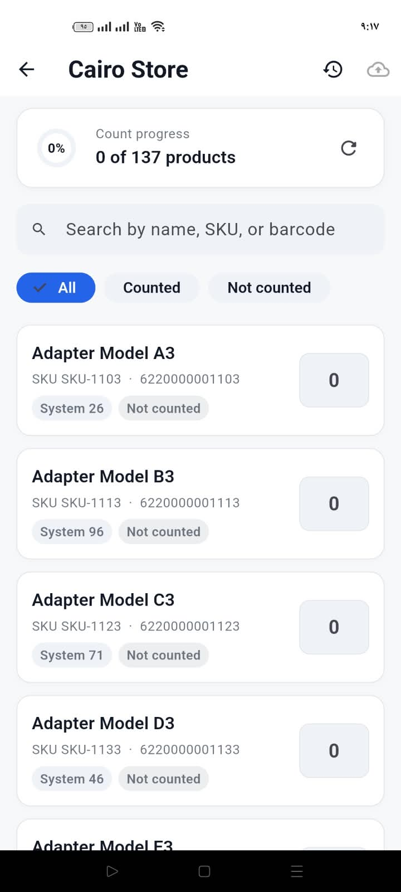
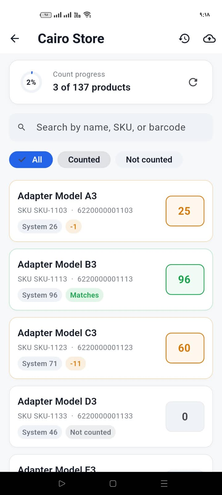
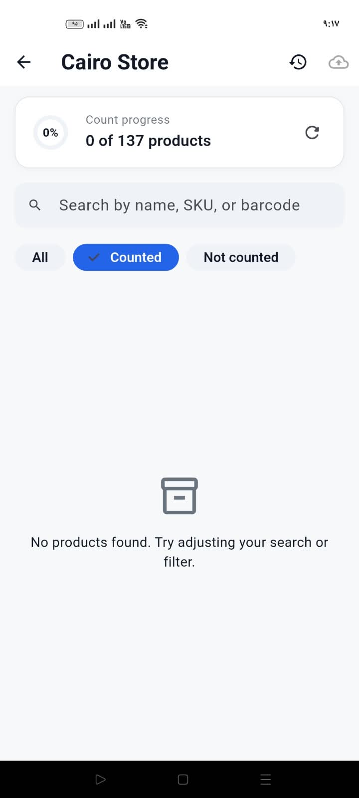
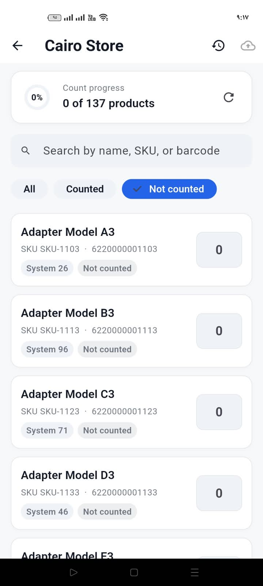
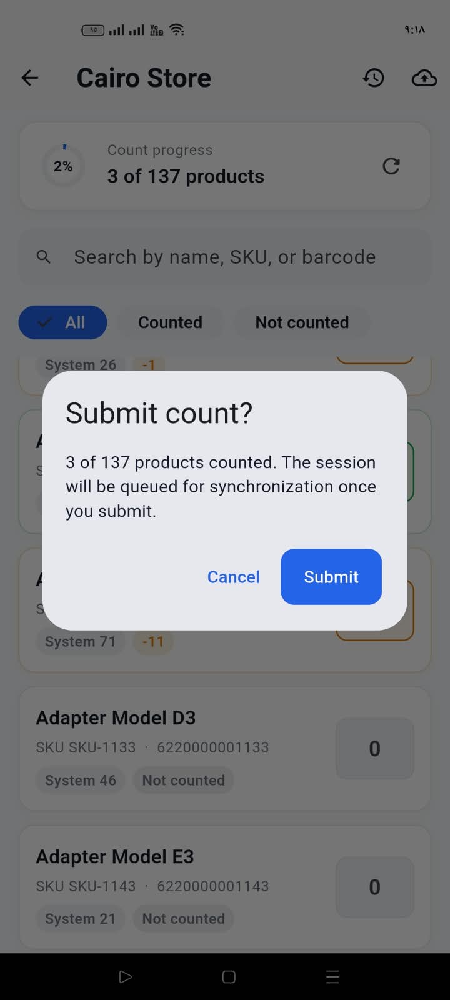
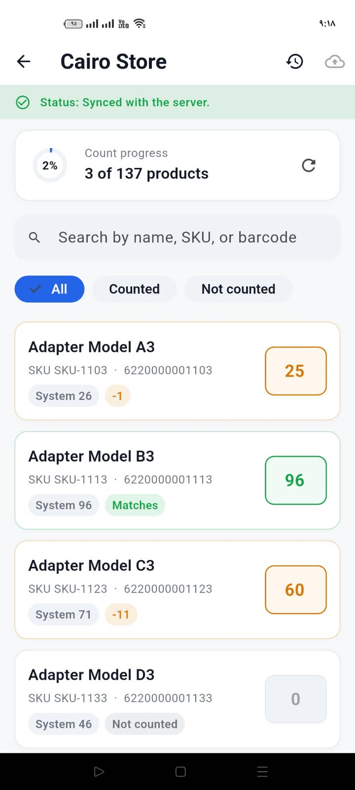
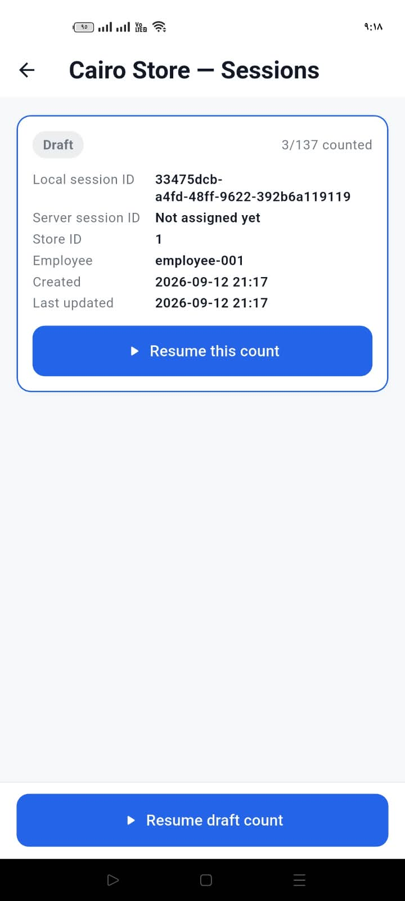
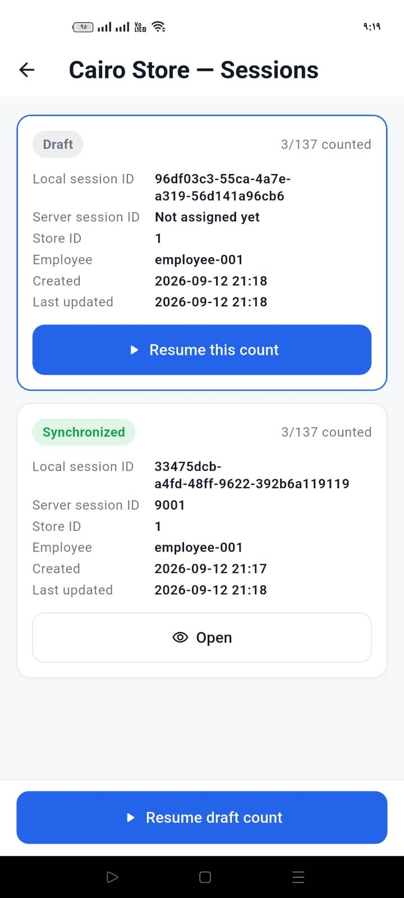

# Inventory Count

Offline-first inventory count and synchronization app (Senior Flutter
Developer assessment). An employee picks a store, counts stock online or
offline, submits, and reviews any version conflict before it syncs.

## Download

- **Signed release APK** — [download](https://drive.google.com/file/d/1wI36K5_ufGRsrUiKllgyT9pHRXbgpmYa/view?usp=drive_link)
- **Demo recording** — [watch](https://drive.google.com/file/d/1SZNkmLmFySOw6u77THOOG6RGRstAmemu/view?usp=drive_link)
- **Design decisions** — [ADR 0001: offline sync & idempotency](docs/adr/0001-offline-sync-and-idempotency.md)

## Run

```bash
flutter pub get
flutter run        # no API key or backend URL needed — the backend is simulated
flutter test       # 67 tests
flutter analyze
```

Flutter 3.44.9 · Dart 3.12.2. On Windows, if the first build fails with
`RelocatableFileToPathConverter`, put `PUB_CACHE` on the same drive as the
project, then `flutter clean && flutter pub get`.

## Screens

| Store selection | Product list | Counting |
|---|---|---|
|  |  |  |

| Filter: counted | Filter: not counted | Submit |
|---|---|---|
|  |  |  |

| Synced | Sessions (draft) | Sessions (synced + new draft) |
|---|---|---|
|  |  |  |

## Architecture

`presentation → domain → data`, per feature (`features/stores`,
`features/inventory_count`), shared code in `core/`.

- **State**: Cubit + `sealed` states, no Freezed/build_runner.
- **DI**: `get_it` (`core/di/injector.dart`).
- **Errors**: data layer throws typed exceptions → `guardApiCall` maps them
  to `Failure` → use cases return `ApiResult<T>` → UI renders states.
- **Local storage**: sqflite (`products`, `count_sessions`, `count_items`,
  `sync_conflicts`), store list + selection in `SharedPreferences`.
- **Backend**: `core/fake_backend/` — in-process simulation of the documented
  contract, with `forceOffline` / `forceTimeout` / `forceUnauthorized` /
  `forceServerError` knobs and `simulateConcurrentSale()` for the worked
  conflict example.

## Offline behaviour

Downloaded stores and products stay readable with no connection; counts are
written to sqflite as they're typed and survive an app kill. Submitting
offline moves the session to **Pending synchronization** without burning a
retry attempt — the request never left the device — and it syncs itself when
connectivity returns.

```
draft → pendingSync → syncing → synced | conflict | failed
                ↑                  |        |
                └──── retry ───────┘   resolve/cancel
```

Every transition goes through `CountSessionStateMachine.next()`, which throws
on an illegal one.

## Synchronization

- **Idempotency key** generated once per session, sent as the
  `Idempotency-Key` header on every submit/retry with `clientSessionId` and
  `createdAt` in the body — a retry can never create a second server session.
  Conflict responses are deliberately *not* cached against that key: they
  write nothing server-side, and caching one would make resolution impossible.
- **Single-flight guard**: an in-memory set of syncing session ids, so
  double-tapping Submit/Retry fires one request.
- **Connectivity is a trigger, not the truth** — real request failures are
  handled on their own terms; `NetworkFailure` requeues, anything else fails
  with an explicit Retry.
- **Crash recovery**: sessions stuck in `syncing` at startup are reset to
  `pendingSync` (safe, because retries are idempotent).

See [ADR 0001](docs/adr/0001-offline-sync-and-idempotency.md).

## Conflicts

A conflict is detected server-side when a product's `expectedVersion` (snapshotted
when the employee typed the count, never re-read at submit) no longer matches.
The review screen shows, per product: original system quantity, the server's
current quantity, the employee's count, and the version jump — then **Keep my
count** (default) or **Use server value**, and Confirm & Resubmit or Cancel.
Cancel returns the session to `draft` with nothing lost.

## Security

Auth is mocked (`core/auth/mock_session.dart`). In production: tokens in
`flutter_secure_storage` (never SharedPreferences/sqflite), an interceptor
attaching the access token and refreshing once on 401 — `UnauthorizedFailure`
is already modelled — clearing user-scoped cached rows on logout, `GET /stores`
returning only permitted stores, and logs carrying status codes only, never
tokens or bodies. No secrets are committed.

## Performance

Pagination end to end (API `page`/`limit`, sqflite `LIMIT`/`OFFSET` over
covering indexes, 50 rows/page in the list), debounced indexed `LIKE` search,
per-row rebuild scope, batched catalog upserts. A 20,000-product catalogue is
never materialized at once. Not built: moving JSON decode to an isolate via
`compute()` — negligible at this contract's page sizes.

## Limitations

- One active draft session per store (as scoped by the assessment).
- Quantities aren't locked once a session leaves `draft`; production would
  lock them at submit.
- No OS-level background sync (WorkManager/BGTaskScheduler) — sync progresses
  while the app is open.
- The simulated backend is in-memory and resets on restart; the sqflite state
  is what must survive, and does.
- No pull-to-refresh; the header's refresh icon does it.

## Tests

67 tests: quantity math, state-machine transitions, duplicate-submission
prevention, version-conflict detection, offline/pending/failed paths, store
offline cache, sqflite data source, and widget tests covering store selection,
search + pagination, and the full conflict review flow.

## AI tool disclosure

Claude Code was used for scaffolding, refactoring, and test authoring;
architecture and design decisions are documented above and in the ADR.
